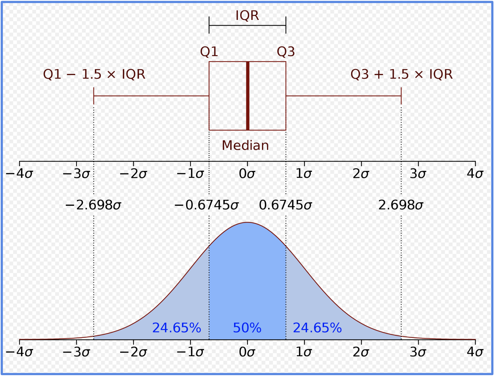
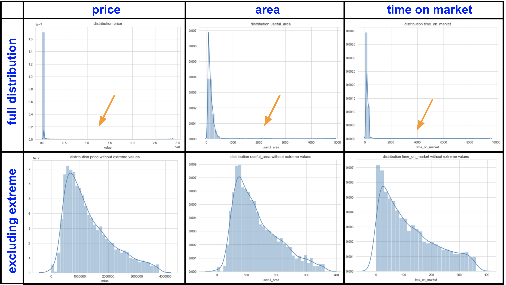
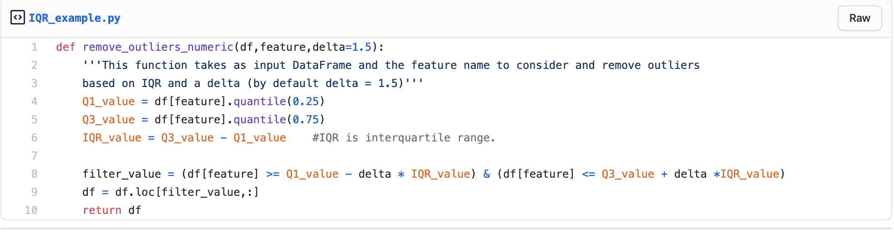
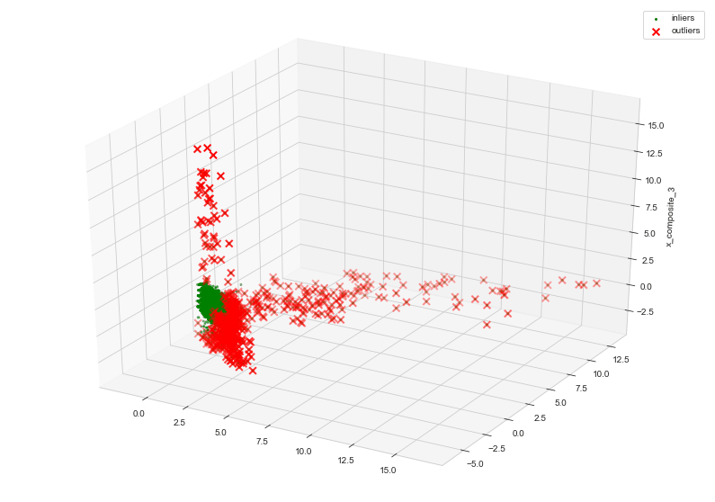
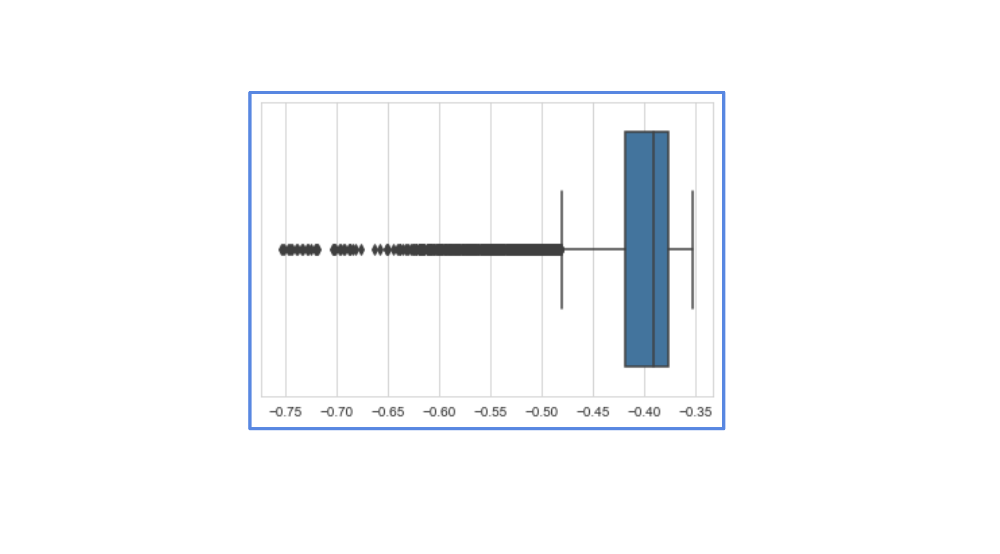
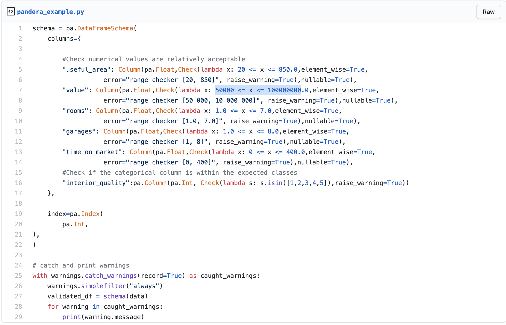
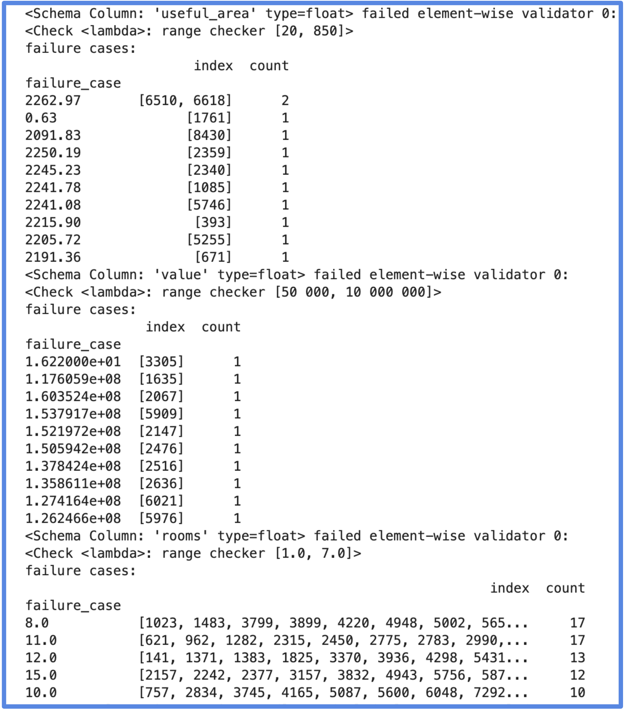

# A production ready approach for outlier detection and monitoring

## Introduction

Photo by Will Myers from  [unsplash.com](https://unsplash.com)

Production data in ML projects are often polluted by anomalies also called outliers.
These outliers might be due to an error in a process or simply be part of your dataset. It is important
to identify and correct for them as they can disturb your modelling/interpretation of your data.
In this article, we are going to present a production ready approach in order to detect and monitor outliers,
enabling you to save some precious time to build your ML pipeline.

In a first step, we are going to show an easy and effective manner to detect outliers column-wise using the interquartile range (IQR).

In a second step, we are going to treat outliers from a multidimension perspective (multi-columns),
and detect them automatically using isolation forest.

Finally, we are going to show an effective way to monitor your database with pandera, a statistical data validation toolkit.

The dataset being used in this project is available at [data demo outliers](https://github.com/vbelz/Outliers_detection/tree/main/data). This is a fictitious dataset representing real estate data.
It contains 6 columns representing `rooms` (number of rooms), `garages` (number of garages), `useful_area` (area of the flat), `value` (price of the flat), `interior_quality` (interior quality of the flat), `time_on_market` (time needed to sell the flat). I introduced several anomalies in the 6 columns to demonstrate the effectiveness of the metodologies presented below.

The code for this article is available on this [github repository](https://github.com/vbelz/Outliers_detection)
including a jupyter notebook example for each of the sections (`./demo/Explore_outliers_per_column.ipynb`,
`./demo/Explore_outliers_multi_columns.ipynb`, `./demo/Monitor_outliers_pandera.ipynb`  )

## Easily detect outliers column-wise with IQR

Photo by Jhguch from  [en.wikipedia](https://en.wikipedia.org/wiki/Interquartile_range)

The interquartile range (IQR) is a measure of statistical dispersion, being equal to the difference between 75th and 25th percentiles,
or equivalently between upper and lower quartiles, IQR = Q3 − Q1.

It can be used to extract the most anomalous values for each of the column from our data.

One way to do so is to consider as potential outliers, data of each column outside the range Q1 - 1.5 * IQR, Q3 + 1.5 * IQR.

Per column, we can look at the distribution with all values vs distribution excluding these outliers.

When the distribution have a very different shape, it highlights the presence of outliers within the column as illustrated below.

Here we can see on the first row the full distribution for price, area and time on market. On the second row, we applied the IQR filtering before
plotting the distribution:

[IQR filtering code example](https://gist.github.com/vbelz/8a09ff54ed740b71bf8aafeaa009d193)

We can see that without the filtering the distributions are highly peaked, highlighting the presence of outliers.
The plots after filtering are more representative of the true data distribution. Based on these plots and our knowledge of the data, we can decide what range of data would be acceptable for each column.

For this example, we would not expect price outside of range 50 000 - 10 000 000 Reais, area outside range 20-850 m2, time on market outside of range
0-400 days. We can perform this type of outlier EDA for each of our column. This will be useful to set up our business rules for each column in the
section for outliers monitoring using pandera.

## Isolation forest to detect outliers from multi-columns

On many occasions, there is the need to detect outliers from a multi-dimensional perspective. For example, it can be the case where you have a model depending on
many features. In this context, detecting outliers per feature (per column for structured tabular data) is not enough. What you would like to do is to treat outliers multi-dimensionally. Isolation forest is an ideal tool to identify these anomalous points.

Isolation forest is an unsupervised learning algorithm for anomaly detection working on the principle of isolating anomalies. It relies on the fact that anomalous observations are less frequent than regular observations and are different from them in terms of values (they lie further away from the regular observations in the feature space). This means that outliers are easier to separate (isolate) from the rest of the samples.

Isolation forest is a tree ensemble method built on the basis of decision trees. The algorithm recursively generates partitions by first randomly selecting a feature and then selecting a random split value between the minimum and maximum value of the selected feature. The process carries on until a single point is isolated or a specified maximum depth is reached. Once the algorithm runs through the whole data, it considers anomalies the data points which took fewer steps than others to be isolated (fewer splits were necessary to isolate them).

For this project, I used the isolation forest implementation from `Scikit-Learn` library.
After training, the `predict` method can be called to know  if a particular sample is an outlier or not.
Normal samples are labelled 1 and outliers labelled -1.
In order to visualize our high dimension data, PCA can be applied to the features to reduce the dimension of the data (according to the variance). We can then  plot the three first components highlighting in green normal data and red outliers. We can see that anomalies have the tendency to locate away from our main data. This is an useful way to QC the application of the isolation forest algorithm. The code to identify anomalies and generate the PCA plot can be found below (and more details are available in the [github repository](https://github.com/vbelz/Outliers_detection)).

[Plot 3D PCA scatter plot](https://gist.github.com/vbelz/b26564b0b68bf271ed9cfc995f49828c)

In some cases, it might be useful to control your anomalies threshold, or the maximum quantity
of data points that you would like to be considered as abnormal. To do so, it is useful to called
the `score_samples` method in order to obtain an anomaly score for each point of your dataset.
You can then display these scores in a boxplot (picture example below) in order to choose different thresholds. The lower the score, the more abnormal the data point will be. Choosing a lower threshold will allow to decrease the number of anomalous points to detect.

You can even decide a percentage of your dataset you would like to be considered as anomalous. All these examples of behaviours are demonstrated in the jupyter notebook `./demo/Explore_outliers_multi_columns.ipynb`, using the functions created in `./demo/outliers_util.py`.
We generated 3D PCA scatter plots for different anomaly thresholds to create the gif illustration.
We can see that we can decide to be more or less conservative for our outliers detection.
This is a very powerful tool to be used in your ML pipeline as the presence of anomalies in your dataset can disturb your model behaviour/performance. By automatically detecting and removing the most abnormal data points using isolation forest, you are likely to improve your overall model performance. In particular, if your production data contains a high number of samples (of high dimension), removing the 0.5% most anomalous (at almost no extra-cost) would be a good production practice.

## Monitor your data with pandera: a statistical data validation toolkit for pandas

In production environments, databases are regularly updated and anomalies should be monitored. Now that we have seen techniques to detect and remove outliers from your production data, we are going to see how we can monitor regularly your database and perform statistical validation checks with [pandera](https://pandera.readthedocs.io/en/stable/).

Pandera provides a flexible and expressive data validation toolkit that helps users make statistical assertions about pandas data structures.

Based on your knowledge of your data, you can easily use pandera to implement rules to check the type and the accepted range within your features. As an example below, we created some rules for our demo dataset. As we have seen in our outlier EDA, the column `useful_area` should be a float and we would not expect values outside the range 20-850m2.
Similarly, we created rules for the remaining columns `value` (price), `rooms`, `garages`, `time_on_market` and `interior_quality`. For example, the column `interior_quality` should contain integer values within 1, 2, 3, 4 or 5.
Below, an example of how the code looks like for our demo dataset.

[Pandera code example](https://gist.github.com/vbelz/c8fd3bc85932ca0d9bfb270e985d9f91)

After having defined the rules based on your dataset knowledge, you can regularly run your pandera code to identify new anomalies within your database.  If some new data points are not respecting the rule you defined, it will output some warning message highlighting the issues to be corrected. It is a powerful and easy way to ensure the data quality of your database at different time periods.

Below an example of how would be the output in the case where we did not removed outliers from our dataset.

## Conclusion

We presented an approach to detect (and remove) outliers from your database.
First, per column, IQR can be used to explore, identify and remove abnormal data points, using a distribution plot to QC if your distribution shape is affected or not by outliers.
Second, from a multi-column perspective, we have seen how isolation forest can be used to automatically detect abnormal observations in the feature space. Removing these anomalies before the training of your model will improve the robustness of your ML pipeline.

We then presented an approach to monitor your production data and detect new anomalies at different time periods. Pandera makes statistical data validation easy ensuring that your database is regularly free from anomalies.

All these techniques contribute to ensure a better quality of your data, allowing you to be more productive by focusing on other areas of your ML pipeline.

## References

>Liu, Fei Tony, Ting, Kai Ming and Zhou, Zhi-Hua. “Isolation-based anomaly detection.” ACM Transactions on Knowledge Discovery from Data (TKDD) 6.1 (2012): 3.
>
>[https://cs.nju.edu.cn/zhouzh/zhouzh.files/publication/tkdd11.pdf]

>Liu, Fei Tony, Ting, Kai Ming and Zhou, Zhi-Hua. “Isolation forest.” Data Mining, 2008. ICDM’08. Eighth IEEE International Conference on.
>
>[https://cs.nju.edu.cn/zhouzh/zhouzh.files/publication/icdm08b.pdf?q=isolation-forest]

>
>
>[https://towardsdatascience.com/outlier-detection-theory-visualizations-and-code-a4fd39de540c]

>
>
>[https://www.pyopensci.org/blog/pandera-python-pandas-dataframe-validation]

>
>
>[https://towardsdatascience.com/how-automated-data-validation-made-me-more-productive-7d6b396776]

> Pandera documentation:
>
> [https://pandera.readthedocs.io/en/stable/]
