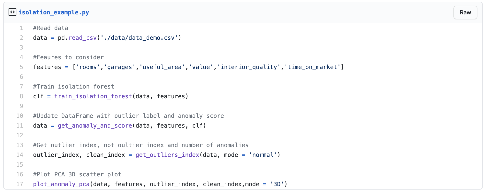

# A production ready approach for outlier detection and monitoring

## Introduction

Photo by Will Myers from  [unsplash.com](https://unsplash.com)
---

Production data in ML projects are often polluted by anomalies also called outliers.
These outliers might be due to an error in a process or simply be part of your dataset. It is important
to identify and correct for them as they can disturb your modelling/interpretation of your data.
In this article, we are going to present a production ready approach in order to detect and monitor outliers,
enabling you to save some precious time to build your ML pipeline.

In a first step, we are going to show an easy and effective manner to detect outliers column-wise using the interquartile range (IQR).

In a second step, we are going to treat outliers from a multidimension perspective (multi-columns),
and detect them automatically using isolation forest.

Finally, we are going to show an effective way to monitor your database with pandera, a statistical data validation toolkit.

The dataset being used in this project is available at [data demo outliers](https://github.com/vbelz/Outliers_detection/tree/main/data). This is a fictitious dataset representing real estate data.
It contains 6 columns representing `rooms` (number of rooms), `garages` (number of garages), `useful_area` (area of the flat), `value` (price of the flat), `interior_quality` (interior quality of the flat), `time_on_market` (time needed to sell the flat). I introduced several anomalies in the 6 columns to demonstrate the effectiveness of the metodologies presented below.

The code for this article is available on this [github repository](https://github.com/vbelz/Outliers_detection)
including a jupyter notebook example for each of the sections (`Explore_outliers_per_column.ipynb`,
`Explore_outliers_multi_columns.ipynb`, `Monitor_outliers_pandera.ipynb`  )

## Easily detect outliers column-wise with IQR

Photo by Jhguch from  [en.wikipedia](https://en.wikipedia.org/wiki/Interquartile_range)
---

The interquartile range (IQR) is a measure of statistical dispersion, being equal to the difference between 75th and 25th percentiles,
or equivalently between upper and lower quartiles, IQR = Q3 − Q1.

It can be used to extract the most anomalous values for each of the column from our data.

One way to do so is to consider as potential outliers, data of each column outside the range Q1 - 1.5 * IQR, Q3 + 1.5 * IQR.

Per column, we can look at the distribution with all values vs distribution excluding these outliers.

When the distribution have a very different shape, it highlights the presence of outliers within the column as illustrated below.

Here we can see on the first row the full distribution for price, area and time on market. On the second row, we applied the IQR filtering before
plotting the distribution:

[IQR filtering code example](https://gist.github.com/vbelz/8a09ff54ed740b71bf8aafeaa009d193)

We can see that without the filtering the distributions are highly peaked, highlighting the presence of outliers.
The plots after filtering are more representative of the true data distribution. Based on these plots and our knowledge of the data, we can decide what range of data would be acceptable for each column.

For this example, we would not expect price outside of range 50 000 - 10 000 000 Reais, area outside range 20-850 m2, time on market outside of range
0-400 days. We can perform this type of outlier EDA for each of our column. This will be useful to set up our business rules for each column in the
section for outliers monitoring using pandera.

## Isolation forest to detect outliers from multi-columns

On many occasions, there is the need to detect outliers from a multi-dimensional perspective. For example, it can be the case where you have a model depending on
many features. In this context, detecting outliers per feature (per column for structured tabular data) is not enough. What you would like to do is to treat outliers multi-dimensionally. Isolation forest is an ideal tool to identify these anomalous points.

Isolation forest is an unsupervised learning algorithm for anomaly detection working on the principle of isolating anomalies. It relies on the fact that anomalous observations are less frequent than regular observations and are different from them in terms of values (they lie further away from the regular observations in the feature space). This means that outliers are easier to separate (isolate) from the rest of the samples.

Isolation forest is a tree ensemble method built on the basis of decision trees. The algorithm recursively generates partitions by first randomly selecting a feature and then selecting a random split value between the minimum and maximum value of the selected feature. The process carries on until a single point is isolated or a specified maximum depth is reached. Once the algorithm runs through the whole data, it considers anomalies the data points which took fewer steps than others to be isolated (fewer splits were necessary to isolate them).

[Plot 3D PCA scatter plot](https://gist.github.com/vbelz/b26564b0b68bf271ed9cfc995f49828c)

## Monitor your data with pandera: a statistical data validation toolkit for pandas

[Pandera code example](https://gist.github.com/vbelz/c8fd3bc85932ca0d9bfb270e985d9f91)

## References

>Liu, Fei Tony, Ting, Kai Ming and Zhou, Zhi-Hua. “Isolation-based anomaly detection.” ACM Transactions on Knowledge Discovery from Data (TKDD) 6.1 (2012): 3.
>
>[https://cs.nju.edu.cn/zhouzh/zhouzh.files/publication/tkdd11.pdf]

>Liu, Fei Tony, Ting, Kai Ming and Zhou, Zhi-Hua. “Isolation forest.” Data Mining, 2008. ICDM’08. Eighth IEEE International Conference on.
>
>[https://cs.nju.edu.cn/zhouzh/zhouzh.files/publication/icdm08b.pdf?q=isolation-forest]

>
>
>[https://towardsdatascience.com/outlier-detection-theory-visualizations-and-code-a4fd39de540c]

>
>
>[https://www.pyopensci.org/blog/pandera-python-pandas-dataframe-validation]

>
>
>[https://towardsdatascience.com/how-automated-data-validation-made-me-more-productive-7d6b396776]

> Pandera documentation:
>
> [https://pandera.readthedocs.io/en/stable/]
